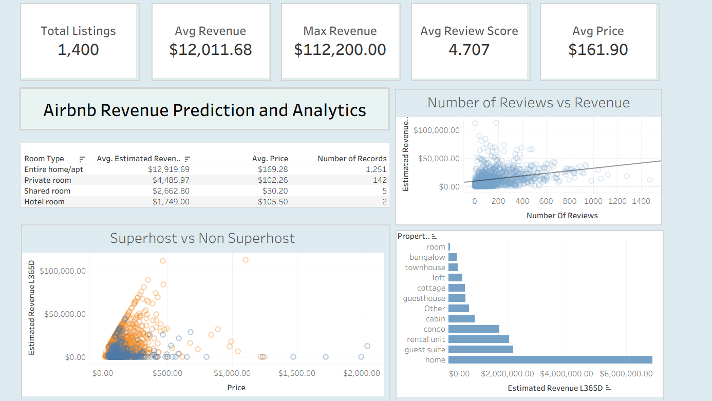

# Airbnb Revenue Prediction

This project analyzes Airbnb listings and builds machine learning models to predict listing revenue. It combines statistical hypothesis testing with machine learning techniques to identify key revenue drivers and determine the best predictive model.

---

## Project Structure

```
airbnb-revenue-prediction/
│
├── notebooks/
│   ├── EDA_&_Stats.ipynb   # EDA and statistical analysis
│   └── Modelling.ipynb     # Machine learning modeling and evaluation
│
├── README.md
└── .gitignore
```

---

## Project Overview

This project aims to:

* Perform comprehensive exploratory data analysis (EDA)
* Conduct statistical hypothesis testing
* Build and compare multiple machine learning models
* Identify key drivers of listing revenue
* Select the best-performing predictive model

The goal is to predict listing revenue accurately while understanding which features most influence financial performance.

---

## Part 1 — Exploratory Data Analysis and Statistical Testing

### Data Cleaning and Preparation

* Removed irrelevant neighborhoods
* Handled missing values
* Treated skewed distributions
* Performed log transformation on revenue
* Removed outliers where necessary

### Skewness Handling

The target variable `estimated_revenue_l365d` was highly right-skewed:

* Original skewness: **2.12**
* After log transformation: **-1.57**

Log transformation stabilized variance and improved model performance.

### Statistical Hypothesis Testing

Hypothesis tests were conducted to determine whether categorical variables significantly impacted revenue.

**Tests Performed:**

* t-test (unequal variances)
* ANOVA (for multi-category comparisons)

**Variables Tested:**

* Superhost status
* Host identity verification
* Host profile picture presence
* Instant booking availability
* Other host- and listing-level categorical features

**Key Findings:**

* Superhost status showed statistically significant revenue differences
* Some host verification variables had modest significance
* Several features showed no statistically significant impact
* Imbalanced category distributions limited statistical power in some cases

This stage validated meaningful relationships before machine learning modeling.

## Tableau Dashboard


---

## Part 2 — Machine Learning Modeling

### Target Variable

Two modeling approaches:

1. Log-transformed revenue (`log_revenue`)
2. Raw revenue (`estimated_revenue_l365d`)

Log-transformed revenue produced more stable and interpretable results.

### Modeling Pipeline

Pipeline implemented using:

* `ColumnTransformer`
* `StandardScaler` (numeric features)
* `OneHotEncoder` (categorical features)
* `GridSearchCV` with 5-fold cross-validation
* Train/Test split

This ensures:

* No data leakage
* Robust hyperparameter tuning
* Reliable generalization performance

---

## Models Compared

1. Linear Regression (baseline)
2. Lasso Regression (regularized linear model)
3. Ridge Regression 
4. Decision Tree Regressor
5. Random Forest Regressor

Hyperparameters were tuned using GridSearchCV.

---

## Final Results

### Random Forest (Best Overall Model)

**Best Parameters:**

* `n_estimators = 200`
* `max_depth = None`
* `min_samples_split = 2`
* `random_state = 42`

**Performance:**

* Best CV RMSE: **0.1218**
* Test RMSE: **0.0953**

The Random Forest captured non-linear relationships and feature interactions effectively.

### Lasso Regression (Best Linear Model)

**Best Parameters:**

* `alpha = 0.0379`
* `max_iter = 10000`

**Performance:**

* Best CV RMSE: **1.5844**
* Test RMSE: **1.4637**

Lasso improved generalization but could not capture non-linear patterns.

---

## Key Insights

* Revenue relationships are strongly non-linear
* Tree-based ensemble models significantly outperform linear models
* Feature interactions matter in revenue prediction
* Log transformation improves stability
* Cross-validation ensures robust generalization

---

## Technologies Used

* Python
* Pandas
* NumPy
* Scikit-learn
* Matplotlib
* Seaborn
* Jupyter Notebook

---

## Conclusion

This project demonstrates an end-to-end data science workflow:

**Business Understanding → Statistical Validation → Feature Engineering → Model Development → Hyperparameter Tuning → Evaluation → Insight Generation**

Key takeaways:

* Non-linear modeling is crucial for revenue prediction
* Statistical testing validates meaningful features before modeling
* Ensemble models with feature interactions outperform linear models


